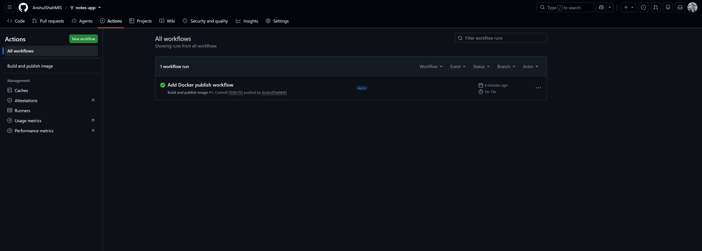
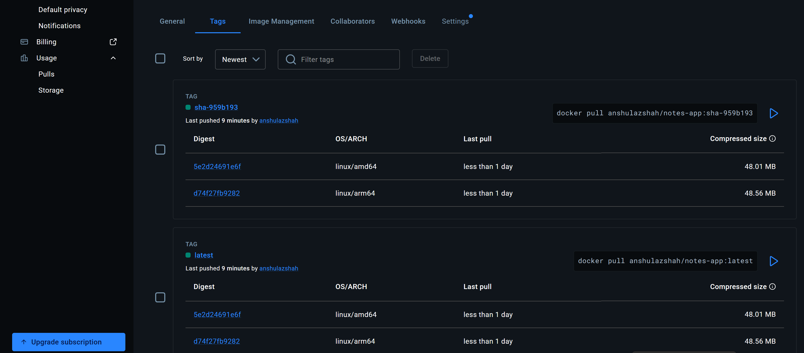

# Lab 5 Evidence

**Repository:** https://github.com/AnshulShahMIS/notes-app
**Docker Hub:** https://hub.docker.com/r/anshulazshah/notes-app

## 1. Successful GitHub Actions run



## 2. Docker Hub tags showing both architectures



Both `latest` and `sha-959b193` list `linux/amd64` and `linux/arm64`.

## 3. kubectl get all,pvc

```
NAME                       READY   STATUS    RESTARTS   AGE
pod/db-6c5c8947cd-6rw4c    1/1     Running   0          7m24s
pod/web-64b794fc6b-q2xjw   1/1     Running   0          2m7s
pod/web-64b794fc6b-t85q4   1/1     Running   0          2m7s

NAME          TYPE        CLUSTER-IP     EXTERNAL-IP   PORT(S)    AGE
service/db    ClusterIP   10.96.62.234   <none>        5432/TCP   7m24s
service/web   ClusterIP   10.96.62.122   <none>        80/TCP     2m7s

NAME                  READY   UP-TO-DATE   AVAILABLE   AGE
deployment.apps/db    1/1     1            1           7m24s
deployment.apps/web   2/2     2            2           2m7s

NAME                             DESIRED   CURRENT   READY   AGE
replicaset.apps/db-6c5c8947cd    1         1         1       7m24s
replicaset.apps/web-64b794fc6b   2         2         2       2m7s

NAME                            STATUS   VOLUME                                     CAPACITY   ACCESS MODES   STORAGECLASS   AGE
persistentvolumeclaim/db-data   Bound    pvc-0d45b547-d97a-4d4a-b3a8-0fcc78413358   1Gi        RWO            standard       7m24s
```

## 4. Experiment 2 — data persistence across a database pod deletion

Created a note, deleted the `db` pod, waited for the replacement to become ready, then listed notes:

```
[{"body":"hello from kubernetes","created_at":"2026-09-28T18:25:03.974803+00:00","id":1},
 {"body":"I should survive a pod deletion","created_at":"2026-09-28T18:28:56.785777+00:00","id":2}]
```

Both notes survived. The data lives on the PersistentVolumeClaim `db-data`, which has its own lifecycle independent of the pod. The replacement pod mounted the same volume and found the existing database files, including the sequence counter (the new note received `id: 2`).

## 5. Experiment 3 — load balancing across replicas

Scaled `web` to 4 replicas and called the Service by its cluster DNS name from a pod inside the cluster:

```
{"message":"Hello from the PR branch!","served_by":"web-64b794fc6b-sscxt","service":"notes-app"}
{"message":"Hello from the PR branch!","served_by":"web-64b794fc6b-5cwsp","service":"notes-app"}
{"message":"Hello from the PR branch!","served_by":"web-64b794fc6b-5cwsp","service":"notes-app"}
{"message":"Hello from the PR branch!","served_by":"web-64b794fc6b-gh88l","service":"notes-app"}
{"message":"Hello from the PR branch!","served_by":"web-64b794fc6b-8czqt","service":"notes-app"}
{"message":"Hello from the PR branch!","served_by":"web-64b794fc6b-gh88l","service":"notes-app"}
{"message":"Hello from the PR branch!","served_by":"web-64b794fc6b-gh88l","service":"notes-app"}
{"message":"Hello from the PR branch!","served_by":"web-64b794fc6b-gh88l","service":"notes-app"}
```

Four distinct `served_by` values (`sscxt`, `5cwsp`, `gh88l`, `8czqt`) — every replica served at least one request. Distribution is uneven because a Service balances per connection rather than strict round-robin.

## 6. kubectl rollout history after the rolling update

```
deployment.apps/web
REVISION  CHANGE-CAUSE
4         <none>
5         <none>
```

Kubernetes retains a limited revision history by default, so earlier revisions have aged out.

During the rolling update from `:latest` to `sha-ebb13cf`, `kubectl get pods -w` showed each new pod reaching `1/1 Running` before any old pod began terminating. There were never fewer than two ready replicas, so there was no downtime. The readiness probe on `/readyz` is what makes that safe — traffic only reaches a pod once it can query the database.

## Note on drift

`k8s/web.yaml` pins `:latest`, but the cluster ran `sha-ebb13cf` after the update. Because the pipeline re-pushes `latest` on every build, rolling back to the `:latest` revision returned the same image and the same greeting. Pinning `sha-` tags in Git and applying them would make rollbacks deterministic and keep Git the source of truth.